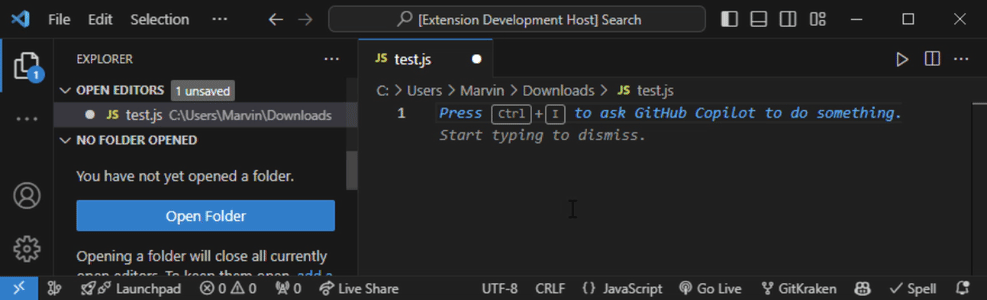

# Achievements for VS Code

## Features

So there are two ways you can use this extension:

1. Code and if you do something unusual or something that is not common, you will get an achievement.

2. Hunt the achievements and try to get them all. Except Line by Line, you can get all achievements immediately.

## Current Language Support

- [x] JavaScript
- [x] TypeScript
- [x] HTML
- [x] Python 

## Commands

To access the commands, press `ctrl+shift+p`

- `Show Achievements`
- `Reset Achievements`

## Achievements Overview Page

## Installation

Download in 

## Development

Press F5 on the extension.ts file to start the extension in a new window.
